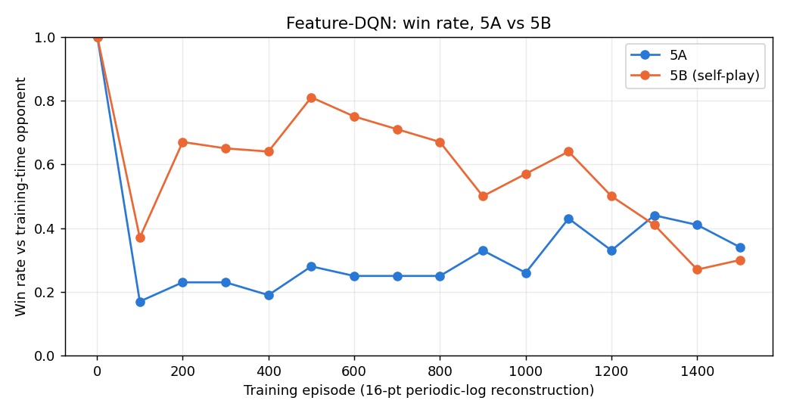
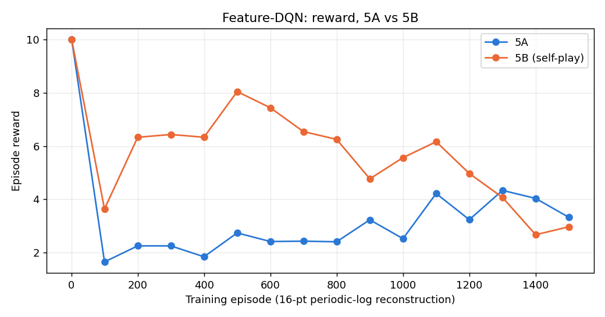
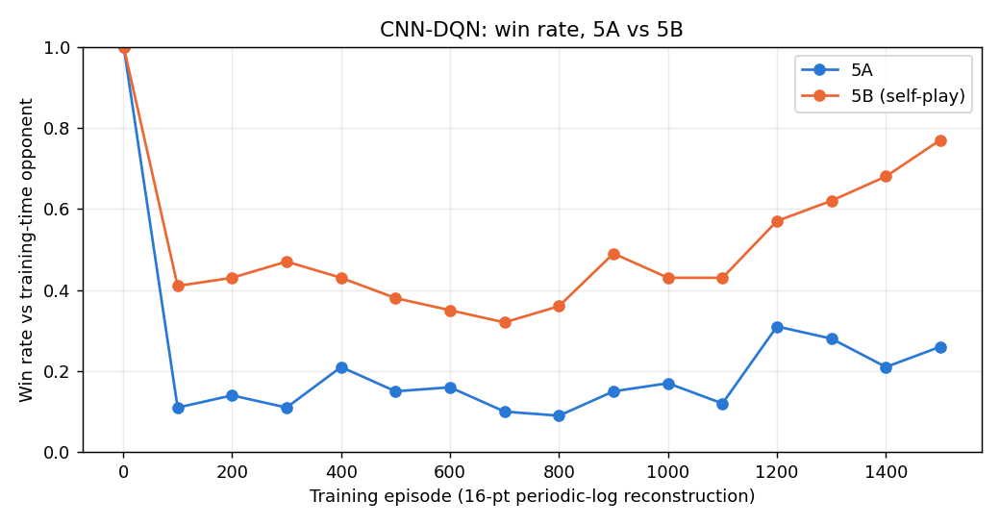
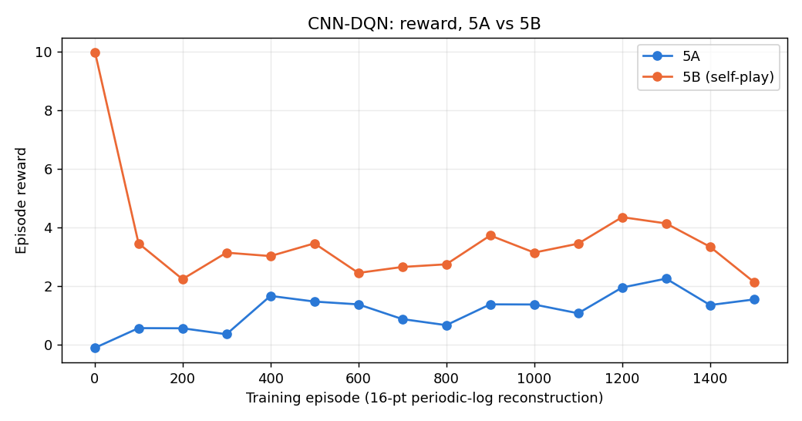

# Paddle Duel RL Arena — Project Report

**SUTD 51.512 Reinforcement Learning for Embodied AI, Y2025-2026**

**Group members:**

| Name | Student ID | Contributions |
|---|---|---|
| Duan Xu | 1010728 | Designed and implemented Level 5 (two-agent self-play): built the fixed-opponent baseline (5A) and self-play training with an opponent pool (5B) for both the Feature-DQN and CNN-DQN architectures, ran the full-scale training and evaluation, and produced the final competition-ready checkpoints. |
| Manan Bimal Mehta | 1010949 | Designed and implemented Levels 1–3 (tabular Q-learning, SARSA, and Expected SARSA agents; exploration-schedule comparison; opponent-zoo robustness evaluation) and Level 4 (Feature-DQN and CNN-DQN pixel-based agents vs. scripted opponents), including all training, evaluation, and baseline comparisons for these levels. |
| Zheng Chengsheng | 1010719 | Wrote and verified the final project report, consolidating results and figures across all five levels, cross-checking reported metrics against the actual notebook/training outputs, and compiling the reproducibility documentation. |

**Full code, notebooks, and saved checkpoints:** https://github.com/FlyGCB/RL-Project
(see `README.md` in the repository for reproduction instructions — several
saved-agent checkpoints are tens of MB and are hosted there rather than
attached directly to this report.)

---

## 1. Introduction

This report covers our design, training, and evaluation of reinforcement
learning agents for **Paddle Duel**, a simplified Pong-style environment
provided for this project. We attempted all five project levels, progressing
from tabular control (Level 1-3) through pixel-based function approximation
(Level 4) to two-agent self-play (Level 5). Section 9 summarises which levels
our final submitted agents support and how performance changes across
difficulty.

The environment itself (`paddle_duel_env.py`) was provided and not modified.
Two players (Left, Right) each choose one of three actions per frame (UP,
DOWN, STAY); an episode is one rally, ending when a side scores (+10) or
after a 60-second/1800-step timeout, in which case cumulative reward decides
the winner. Reward also includes a small per-hit bonus (+0.06 for the first
10 hits, +0.02 after) and a tiny movement penalty (-0.001 for UP/DOWN), as
specified in the project instructions.

Reproducibility instructions, the full checkpoint index, and known
environment gotchas are documented separately in `README.md` at the project
root; this report focuses on design rationale, experiments, and results.

## 2. Methodology overview

Across all levels we followed the same experimental discipline: agents were
trained using a fixed training seed (and, in later levels, an explicit
warm-up period of fully-random actions to seed the replay buffer / Q-table
before epsilon-greedy learning begins), then evaluated over held-out
evaluation seeds disjoint from training. Two baseline opponents were used
throughout Levels 2-5 wherever a fixed opponent was needed: a **Random
Agent** (uniform random action) and a **Tracking Agent** (a scripted paddle
that follows the ball's y-position with configurable noise) — both provided
by the course.

## 3. Level 1 — Tabular control, solo vs wall

**Setting.** Solo paddle practice against a wall (no opponent to train
against); tabular 7-dimensional state
`(my_paddle_y_bin, other_paddle_y_bin, ball_x_bin, ball_y_bin, ball_vx_sign, ball_vy_sign, speed_bin)`.

**Method.** We implemented a single `TabularControlAgent` class supporting
three TD control rules that only differ in their bootstrap target:
Q-learning (`max` over next-state action values), SARSA (value of the action
actually taken next), and Expected SARSA (expectation under the current
epsilon-greedy policy). This isolates the effect of the TD target while
holding the state representation, reward, and training budget identical
across methods — a controlled comparison rather than three independent
implementations.

**Two experiments.** We ran this comparison twice. The first pass
(`Level_1_Qlearning_SARSA_ExpectedSARSA_Comparison.ipynb`) used
`epsilon_min=0.20` and no reward shaping. Reviewing the results, we judged
the forced-exploration warm-up and the epsilon floor to be masking each
method's true converged behaviour, so we re-ran with an improved diagnostic
setup (`Level_1_Comparison_Exploration_and_Diagnostics.ipynb`): a longer
forced-exploration warm-up (400 episodes of fully random actions before
learning begins) and a lower epsilon floor (0.05), plus an optional ablation
that masks the -0.001 movement penalty out of the *training* TD target only
(official reward is still recorded separately for evaluation) to test
whether the movement penalty was discouraging useful paddle movement during
learning.

**Hyperparameters.** alpha=0.1, gamma=0.99, epsilon_start=1.0,
epsilon_decay=0.9999, 2000 training episodes, training seed 0, evaluated with
epsilon forced to 0 over 200 held-out episodes (seed 10,000).

**Results (second, improved experiment):**

| Agent | mean reward | std reward | mean hits | mean steps | learned states |
|---|---|---|---|---|---|
| Q-learning | -0.0445 | 0.7053 | 2.57 | 437.0 | 33,082 |
| SARSA | -0.0864 | 0.3870 | 1.81 | 336.4 | 32,872 |
| Expected SARSA | -0.1202 | 0.1878 | 2.72 | 465.7 | 32,336 |

All three methods had a 100% miss rate against the wall (expected — Level 1
has no opponent to beat, only survival/hit count to optimize) and 0%
timeout rate. Expected SARSA had the lowest reward variance (std 0.19 vs
0.71 for Q-learning), consistent with its theoretically lower-variance
bootstrap target, but Q-learning had the highest mean reward of the three in
this run.

**Failure case.** Replay diagnostics (seed 42) show STAY as the single most
common action for all three agents even though it is never a majority of
steps: Q-learning 85/190 STAY (UP 50 + DOWN 55 = 105 movement actions),
SARSA 110/300 STAY (UP 98 + DOWN 92 = 190 movement actions), Expected SARSA
117/300 STAY (UP 93 + DOWN 90 = 183 movement actions). All three lost or
timed out against the wall in this single-seed replay (Q-learning:
right_scored after 190 steps; SARSA and Expected SARSA: timeout after the
full 300-step replay budget, both credited to "right" on cumulative
reward) — a reminder that "learned" here still means a policy far from
solving even the no-opponent Level 1 task after 2000 training episodes.

**Limitation we flag explicitly:** all Level 1 numbers above come from a
**single training seed**. We did not have time to repeat with 3-5
independent seeds and report mean±std, which both Level 1 notebooks
themselves note as a requirement for a statistically solid conclusion. This
is the single largest methodological gap in our submission — see Section 10.

## 4. Level 2 — Tabular control vs a scripted opponent

**Setting.** Left agent against a scripted opponent, tabular state (same
7-dim representation as Level 1).

### 4.1 Algorithm comparison

We first compared Q-learning vs SARSA with the original, unshaped reward
(`Level_2_Qlearning_vs_SARSA_Normal.ipynb`), same hyperparameters as Level 1
(alpha=0.1, gamma=0.99, epsilon_decay=0.9999, 2000 episodes, 400-episode
forced-exploration warm-up), evaluated over 200 held-out episodes (seed
10,000) against the same opponent used in training, plus the Random and
Tracking baselines:

| Agent | mean reward | win rate | mean hits | mean steps |
|---|---|---|---|---|
| Q-learning | 2.1649 | 0.2150 | 1.11 | 191.5 |
| SARSA | 1.8624 | 0.1850 | 0.94 | 170.8 |
| Random Agent | 1.5015 | 0.1550 | 0.77 | 141.8 |
| Tracking Agent | 7.6266 | 0.7550 | 7.98 | 741.8 |

Both learned agents clear the Random baseline on every metric, but both are
far below the scripted Tracking Agent, which simply tracks the ball's `y`
position. Q-learning outperformed SARSA on every metric in this run, so we
fixed the algorithm to Q-learning for the exploration-schedule study below.

### 4.2 Exploration schedule comparison

With the algorithm fixed to Q-learning, `Level_2_Qlearning_Exploration_Schedules.ipynb`
compares three epsilon schedules over the same 1600 post-warm-up episodes:
**Constant** (epsilon=0.20 throughout), **Linear decay** (1.00→0.05), and
**Exponential decay** (1.00→0.05):

| Schedule | mean reward | win rate | mean hits | mean steps |
|---|---|---|---|---|
| Constant | 1.6729 | 0.1650 | 1.07 | 191.1 |
| Linear | 2.0746 | 0.2050 | 1.245 | 224.6 |
| Exponential | 1.8778 | 0.1850 | 1.025 | 186.9 |

**Linear decay produced the best win rate, reward, and hit count** of the
three schedules on this evaluation set. Our reading: constant epsilon keeps
injecting 20% random actions even late in training, directly costing win
rate at evaluation-adjacent behaviour; the two decay schedules let the
policy exploit more as training progresses, with linear's more gradual
reduction giving slightly more total learning signal than exponential's fast
initial drop in this particular run.

**Failure case.** One exponential-decay replay (seed 42) shows the agent
winning quickly (138 steps, hits=1) purely by early positioning luck rather
than sustained rally play — a reminder that a single replay is not
representative and reinforces the need for the multi-seed evaluation we
flag as a limitation.

## 5. Level 3 — Robustness across an opponent zoo

**Setting.** Left agent evaluated against an "opponent zoo" (random, weak,
tracking, strong, and a mixed "zoo" opponent that samples among them),
tabular state.

**Method.** We trained a single Expected SARSA agent
(`Level_3_Expected_SARSA_Robustness.ipynb`) directly against the mixed
`training_opponent="zoo"` setting (alpha=0.1, gamma=0.99, epsilon_decay=0.9999,
2000 episodes, 400-episode warm-up), then evaluated the **same** trained
agent separately against each individual opponent in the zoo (200 episodes
each, seed 10,000), rather than training five separate specialists — directly
testing generalization, per the level's research question.

**Per-opponent results:**

| Opponent | mean reward | win rate | mean hits | mean steps |
|---|---|---|---|---|
| random | 2.4932 | 0.2500 | 0.60 | 115.0 |
| weak | 1.5004 | 0.1500 | 0.88 | 163.1 |
| tracking | 0.8090 | 0.0800 | 1.13 | 195.7 |
| strong | 0.6597 | 0.0650 | 1.20 | 206.9 |
| zoo (mixed) | 1.7062 | 0.1700 | 0.87 | 158.1 |

**Robustness summary:** average win rate 0.143, worst-case win rate 0.065
(against `strong`), win-rate range 0.185. The **strong** opponent is the
hardest by both win rate and reward — expected, since it is presumably the
best-tuned scripted player in the zoo.

**Failure case.** The replay against `strong` (seed 11) is a clean, fast
loss: only 3 DOWN and 32 STAY actions over 35 steps (hits=0, reward=-0.003) —
the agent barely reacts before conceding the point, a 21px paddle-movement
range versus roughly 3x that for the wins against weaker opponents in the
same replay set. This suggests the single zoo-trained policy has not learned
a defense fast/precise enough for the strongest scripted opponent, even
though it generalizes reasonably (0.15-0.25 win rate) against the weaker
members of the zoo.

## 6. Level 4 — Pixel-only observation, two architectures

**Setting.** Pixel-only observation against scripted opponents (image
observation, no tabular state available). We built and compared two
independent agents, both against the `weak` scripted opponent, both using
standard DQN infrastructure (replay buffer, target network, Huber loss,
Adam, gradient clipping at max_norm=10.0) — the only planned difference is
the observation representation, isolating that variable.

### 6.1 Feature-DQN

Rather than a CNN, `Level_4_Feature_DQN_Baseline.ipynb` first extracts
approximate (x, y) coordinates of both paddles and the ball from the raw RGB
frame plus their frame-to-frame deltas (12-dim feature vector), fed to a
small MLP (`Linear(12→128)→ReLU→Linear(128→128)→ReLU→Linear(128→3)`). This
was deliberately built and validated *before* attempting a CNN, to confirm
the two-agent DQN training loop itself was correct on a cheaper
representation first.

Hyperparameters: lr=1e-4, gamma=0.99, epsilon_decay=0.9999, buffer capacity
50,000, batch_size=64, min_buffer_size=2,000, target_update_steps=1,000,
train_frequency=4; 2,000 training episodes, 400-episode warm-up. Trained on
an NVIDIA RTX 5050 laptop GPU in 2441.9s (305,564 environment steps, 75,892
optimization steps).

**Evaluation (200 episodes, seed 10,000, vs weak):**

| Agent | mean reward | win rate | mean hits | mean steps |
|---|---|---|---|---|
| Feature-DQN | 1.9836 | 0.2050 | 1.075 | 172.2 |
| Random Agent | 1.5015 | 0.1550 | 0.77 | 141.8 |
| Tracking Agent | 7.6266 | 0.7550 | 7.98 | 741.8 |

Feature-DQN modestly beats Random but sits well below the scripted Tracking
Agent — comparable in shape to the Level 2 tabular results, which makes
sense since both are learning from essentially the same underlying
positional information (engineered coordinates vs binned tabular state).

**Failure case.** Replay (seed 22): a loss with heavy erratic movement (107
UP vs 24 DOWN vs 16 STAY, 168px paddle range) yet only 1 hit before conceding
— movement without control, suggesting the learned policy reacts to noise in
the extracted-coordinate features rather than a stable tracking strategy.

### 6.2 CNN-DQN

`Level_4_CNN_DQN_Pixel_Baseline.ipynb` keeps every DQN infrastructure choice
identical to the Feature-DQN baseline and only swaps the observation
representation: raw pixels, grayscaled, resized to 84×84, stacked 4 deep,
through a standard Atari-style conv stack
(`Conv(4→32,k8,s4)→Conv(32→64,k4,s2)→Conv(64→64,k3,s1)→Linear(3136→512)→Linear(512→3)`).
Buffer capacity was reduced to 30,000 (vs Feature-DQN's 50,000) because CNN
optimization is more memory/compute expensive per step; epsilon decay was
slowed slightly (0.99995 vs 0.9999) to compensate for the harder
representation-learning problem.

Training took 6992.4s (~1h56m) — **2.9x longer** than Feature-DQN's 2441.9s
for the same 2,000 episodes, confirming the expected extra cost of learning
perception and control jointly from pixels.

**Evaluation (200 episodes, seed 10,000, vs weak):**

| Agent | mean reward | win rate | mean hits | mean steps |
|---|---|---|---|---|
| CNN-DQN | 6.9040 | 0.7000 | 3.67 | 482.4 |
| Feature-DQN | 1.9836 | 0.2050 | 1.075 | 172.2 |
| Random Agent | 1.5015 | 0.1550 | 0.77 | 141.8 |
| Tracking Agent | 7.6266 | 0.7550 | 7.98 | 741.8 |

CNN-DQN's win rate (0.70) approaches the scripted Tracking Agent (0.755) and
clears Feature-DQN by a wide margin (0.20). The training curve shows *why*:
reward/win-rate stayed modest through episode ~800 (comparable to
Feature-DQN's range) and only broke out sharply after episode ~1300 (reward
2.93→6.17→6.99 between episodes 1300-1900) — consistent with the notebook's
own hypothesis that pixel learning needs more episodes because the network
must learn to *see* the game before it can learn to *play* it, whereas
Feature-DQN starts with the positional information already extracted.

**Failure case.** Where Feature-DQN's failure replay showed erratic
movement, CNN-DQN's equivalent replay (seed 22) is a **win** (44 UP / 32
DOWN / 62 STAY, 1 hit, reward +9.98) — the qualitative gap between the two
architectures is visible even in a single fixed-seed replay, not just
aggregate statistics.

## 7. Level 5 — Two learned agents, self-play

**Setting.** Left and Right both learned agents, pixel/learned-agent
interface, trained and evaluated together. This is the level Duan Xu took
furthest, working with Claude Code as a coding assistant and building
directly on Manan Bimal Mehta's Level 4 Feature-DQN and CNN-DQN checkpoints.

**Design.** Both architectures follow the same two-stage design, split to
mirror Level 4's 4A/4B structure:

- **5A — fixed-opponent baseline.** A fresh learner (left) trains against the
  *frozen* Level 4 model of matching architecture (right). Only the left
  agent's transitions are optimized; this validates the two-agent
  `step_duel` training loop and produces a stable starting policy.
- **5B — self-play with an opponent pool, warm-started from 5A.** The 5A
  checkpoint continues training. The right-side opponent per episode is,
  with probability 0.8, a **live mirror** of the agent's own current weights
  (true self-play), and with probability 0.2, a **frozen snapshot** sampled
  from an 8-slot opponent pool (FIFO-evicted, slot 0 permanently pinned to
  the same frozen Level 4 model used in 5A, later slots populated by
  snapshotting the agent's own weights every 200 episodes). This mirrors the
  Level 3 opponent-zoo idea specifically to guard against the classic
  self-play failure mode where two live agents chase each other's latest
  exploit in a cycle rather than converging to a robust policy. On warm
  start, epsilon reopens modestly (0.3, not reset to 1.0) since the existing
  5A policy is not garbage — only the opponent distribution is changing.

Both stages, both architectures: 1500 episodes, `level=5`, `render_scale=2`,
`max_seconds=15` during training (the official 60s would be far too slow for
1500-episode runs — evaluation cells use the official `max_seconds=30`).

**Reproducing this at full scale takes hours** (~80 min for Feature-DQN,
~160 min for CNN-DQN on an RTX 3070 Ti — see `README.md` §4), so the actual
training that produced the submitted checkpoints was run as a converted,
non-interactive Python script rather than inside the Jupyter kernel, with
console output captured to `logs/*_FULL_TRAIN_log.txt`. The Level
5 notebooks' own cell outputs have been backfilled with this run's real
data (see the disclosure note at the top of each notebook) — no numbers in
this section or those notebooks are fabricated; where a metric was not
captured by the periodic console log (hits/steps/loss moving averages), we
say so rather than inventing a curve.

### 7.1 Final evaluation — 5A vs 5B, same fixed benchmarks

50-episode evaluation, `level=5`, `max_seconds=30`, against frozen Level 4,
Random, and Tracking (Tracking placed on the left side — it is side-aware
and reads unmirrored `info`, so this placement is required for a valid
comparison, see `README.md` §7):

**Feature-DQN**

| Opponent | 5A win rate | 5B (self-play) win rate |
|---|---|---|
| Frozen L4 | 0.54 | **0.24** |
| Random | 0.48 | **0.28** |
| Tracking (right) | 0.02 | 0.02 |
| 5B vs 5A head-to-head | — | 5B wins 44% |
| 5B self-mirror | — | 20% / 80% split (non-degenerate) |

**CNN-DQN**

| Opponent | 5A win rate | 5B (self-play) win rate |
|---|---|---|
| Frozen L4 | 0.20 | **0.72** |
| Random | 0.46 | **0.98** |
| Tracking (right) | 0.02 | **0.20** |
| 5B vs 5A head-to-head | — | 5B wins 86% |
| 5B self-mirror | — | 42% / 58% split (non-degenerate) |

### 7.2 Diagnosis: self-play helped CNN-DQN and hurt Feature-DQN

The two architectures show **opposite** self-play outcomes, and the
training curves explain why (Figures 1-4, reconstructed from the real
16-point periodic training log — reward and win rate against whichever
opponent was sampled that 100-episode window):

**Feature-DQN 5B's win rate against its own training-time opponents peaks at
81% around episode 500, then declines almost monotonically to 27% by episode
1400**, with a small partial recovery to 30% by episode 1500 where training
stopped. Reward tracks the same arc (peak ≈8.0 at episode 500 → trough ≈2.7
at episode 1400). Training was cut off mid-decline, not at a stable
endpoint, which directly explains why the final 5B checkpoint underperforms
both the frozen L4 baseline (24% vs 5A's 54%) and its own 5A checkpoint in a
head-to-head (44%). This is the classic self-play non-stationarity failure
mode the opponent pool was designed to dampen: the pool visibly slowed full
collapse (the self-mirror match stayed a non-degenerate 20/80 split rather
than degenerating to 0-0 draws, so the policy did not go fully inert) but
did not prevent the overall decline against opponents outside the training
loop.

**CNN-DQN 5B, by contrast, dips through a noisy middle third (episodes
500-800, as the opponent pool fills with progressively tougher snapshots of
itself) then climbs steadily through the back half to 77% by episode 1500 —
still rising when training stopped**, with no sign of the Feature-DQN
pattern. Our reading: the much larger CNN capacity (a full conv stack versus
a 12-dimensional feature MLP) gives it more room to represent a genuinely
robust policy instead of overfitting to whichever opponent it saw most
recently — the same representation-capacity story that separated the two
architectures at Level 4 (Section 6) appears again here, but this time it
governs *self-play stability* rather than just raw performance against a
fixed scripted opponent.

**Cross-architecture note:** the Level 4 gap (CNN-DQN clearly beating
Feature-DQN) persists and widens at the 5B (final deliverable) stage —
CNN-DQN 5B beats frozen L4 72% of the time vs Feature-DQN 5B's 24%. But the
relationship is not simply "CNN is always better": Feature-DQN's 5A
*already* beat its frozen L4 opponent more convincingly than CNN-DQN's 5A
did (54% vs 20%) before self-play was introduced. Self-play was necessary
for CNN-DQN to reach a strong final policy, but actively regressed
Feature-DQN's policy in this run.

**Against Tracking, all four Level 5 agents are weak — this is the one
opponent none of them solved.** Tracking is the strongest scripted baseline
used anywhere in this project (see Sections 4 and 6), and both Feature-DQN
variants win only 2% of the time against it (5A and 5B identically). CNN-DQN
5A also wins only 2%; self-play lifts CNN-DQN 5B to 20% — a real four-fold
improvement over 5A, consistent with the mean-score gap narrowing (mean
score for our agent rises from 0.09 at 5A to 1.88 at 5B, while Tracking's
own mean score falls from 9.39 to 6.61) — but CNN-DQN 5B still **loses the
large majority of rallies against Tracking**. So the correct reading of the
self-play result is narrower than "self-play closes the gap to strong
scripted play": self-play helped substantially against the frozen L4 model
and Random, and helped some against Tracking, but did not make CNN-DQN 5B
competitive with Tracking specifically.

### 7.3 Replay evidence

A recorded rally (seed 22, 5B left vs frozen L4 right, `max_seconds=15`) for
each architecture, generated from the actual saved final checkpoints:

- **Feature-DQN 5B vs frozen L4:** left action counts `{UP: 92, DOWN: 38,
  STAY: 74}`, right `{STAY: 204}` — the frozen L4 opponent barely needs to
  move; Feature-DQN 5B loses (reward -0.07 vs +10.06), consistent with the
  aggregate 24% win rate above.
- **CNN-DQN 5B vs frozen L4:** left `{UP: 96, DOWN: 68, STAY: 36}`, right
  `{UP: 77, DOWN: 79, STAY: 44}` — an actively contested rally, and CNN-DQN
  5B **wins** (reward +9.96 vs -0.10).

Full interactive replays (matplotlib animation) are embedded in both Level 5
notebooks' final cells.

## 8. Hyperparameter tuning summary

| Level | What was compared | Winner (this run) |
|---|---|---|
| 1 | Q-learning vs SARSA vs Expected SARSA (TD target) | Q-learning (highest mean reward); Expected SARSA lowest variance |
| 1 | Movement-penalty masking in TD target (ablation) | Diagnostic tool, not a final choice — flagged for further ablation |
| 2 | Q-learning vs SARSA vs scripted opponent | Q-learning |
| 2 | Constant vs linear vs exponential epsilon decay | Linear decay |
| 4 | Feature-DQN vs CNN-DQN buffer capacity (50k vs 30k), epsilon decay (0.9999 vs 0.99995) | Architecture-specific tuning, not a head-to-head sweep |
| 5 | Fixed-opponent (5A) vs self-play + opponent pool (5B) | Architecture-dependent: CNN-DQN benefits, Feature-DQN regresses |
| 5 | Opponent pool live-mirror fraction (0.8) vs pool-only | Not swept — 0.8 was fixed a priori from the Level 3 "opponent zoo" precedent |

We did not have time to run a systematic learning-rate or discount-factor
sweep at any level; the comparisons above (TD target, exploration schedule,
observation representation, self-play vs fixed-opponent) are the
hyperparameter/design axes we actually controlled for. This is discussed
further as a limitation in Section 10.

## 9. Which levels our final agents support

| Level | Attempted | Final agent(s) | Checkpoint(s) |
|---|---|---|---|
| 1 | Yes | Q-learning, SARSA, Expected SARSA (tabular) | `q_learning.pkl`, `sarsa.pkl`, `expected_sarsa.pkl` |
| 2 | Yes | Q-learning (best schedule: linear decay) | `q_learning_level2.pkl` + schedule variants |
| 3 | Yes | Expected SARSA trained on opponent zoo | `expected_sarsa_level3_zoo.pkl` |
| 4 | Yes | Feature-DQN and CNN-DQN, both vs scripted `weak` opponent | `feature_dqn_level4.pt`, `cnn_dqn_level4.pt` |
| 5 | Yes | Feature-DQN and CNN-DQN, both 5A (fixed-opponent) and 5B (self-play) variants | `feature_dqn_level5_5a.pt` / `_selfplay.pt`, `cnn_dqn_level5_5a.pt` / `_selfplay.pt` |

**Performance trend across levels:** win rate against the best available
fixed benchmark (Tracking Agent where used, frozen Level 4 opponent at Level
5) improves substantially from tabular (Level 1-3, generally <25% win rate
against non-trivial opponents) to CNN-DQN pixel learning (Level 4: 70% vs
weak; Level 5 CNN-DQN 5B: 72% vs frozen L4). Feature-DQN is the exception to
a clean monotonic story: it performs respectably as a fixed-opponent learner
(Level 4: 20.5% vs weak; Level 5A: 54% vs frozen L4) but does not benefit
from — and in our Level 5 self-play run, was actively hurt by — the harder
self-play setting, unlike CNN-DQN.

**Recommended final submission for the competition interface:**
`cnn_dqn_level5_selfplay.pt` — the strongest, most self-play-stable agent we
trained against the frozen Level 4 model and Random (72% and 98% win rate
respectively), valid for either the Left or Right slot since the environment
already mirrors observations for the right side. Caveat: it still loses the
majority of rallies against the Tracking scripted baseline (20% win rate,
Section 7.2) — "strongest agent we produced" should not be read as "solves
the game," and a competition matchup against a Tracking-quality opponent (or
another team's strong scripted agent) is the scenario where this checkpoint
is most likely to underperform its Level-4/Random numbers.

## 10. Limitations and future work

- **Single training/evaluation seed at Levels 1-3.** Every tabular result in
  this report comes from one training seed and one evaluation seed set. Both
  Level 1 notebooks explicitly flag this as insufficient for a strong
  scientific conclusion and recommend 3-5 independent seeds with mean±std
  reporting. Given more time, this is the single highest-value addition to
  the tabular sections.
- **No systematic hyperparameter sweep.** We compared *architectural* and
  *algorithmic* choices (TD target, exploration schedule, observation
  representation, self-play vs fixed opponent) but did not sweep learning
  rate, discount factor, or network width/depth independently at any level.
- **Feature-DQN self-play collapse was not re-run to convergence.** Section
  7.2's diagnosis is strong (a clear peak-then-decline pattern from real
  logged data) but we stopped at the pre-planned 1500 episodes rather than
  extending training to see whether the oscillation is a longer cycle that
  would eventually recover, or a genuine instability specific to the smaller
  Feature-DQN's capacity. This is a concrete, well-motivated next
  experiment.
- **hits/steps/loss training curves for Level 5 are unavailable.** The full
  1500-episode-resolution moving averages for these three metrics were
  tracked in memory during training but the periodic console log (the only
  artifact that survived the multi-hour background run) only captured
  reward/win_rate/epsilon every 100 episodes. Re-running with the history
  dict serialized to disk periodically would fix this for future work.
- **Competition-readiness untested end-to-end.** We have not run our final
  agents through the teaching team's actual competition notebook interface,
  only through our own `evaluate_duel_agents`/`play_rally` calls.

## 11. Conclusion

Across five levels of increasing difficulty, the clearest pattern in our
results is that **representation capacity governs not just raw performance
but also training-dynamics stability**. At Level 4, CNN-DQN needed roughly
3x the training time of Feature-DQN but ultimately learned a much stronger
policy from the same reward signal (70% vs 20.5% win rate against a fixed
scripted opponent). At Level 5, that same capacity gap resurfaces as a
*stability* story: CNN-DQN's self-play training climbed steadily to a strong
final policy, while Feature-DQN's self-play training peaked early and then
regressed for the remainder of training, ending up worse than its own
fixed-opponent baseline. The opponent pool we built specifically to guard
against self-play instability partially worked (no agent ever collapsed to
degenerate 0-0 draws) but was not sufficient to prevent Feature-DQN's
decline — a concrete, evidenced limitation rather than a hand-wavy one,
thanks to the real per-100-episode training curves recovered from the actual
training run's logs.

---

*Figures in Section 7 and the checkpoint/reproducibility details referenced
throughout this report are available in `report_assets/`, `saved_agents/`,
and `README.md` at the project root.*
